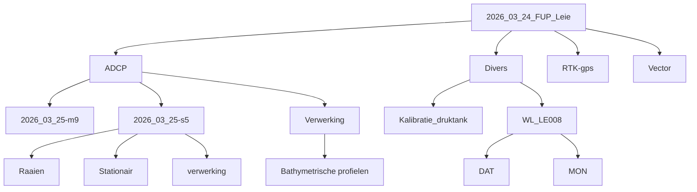

# Schema 2026_03_24_FUP_Leie

Bronmap:
`P:\PA029-BMeetinstr-Cmp\3_Uitvoering\0_03_MEETCAMPAGNES_CALIBRATION_MEETNET\2026_03_24_FUP_Leie`

## Directorydiagram

## Samenvatting

- Hoofdmappen: `ADCP`, `Divers`, `RTK-gps`, `Vector`
- Grootste dataset: `ADCP\2026_03_25-m9`
- Aantallen in `2026_03_25-m9`: `44 x .mat`, `44 x .riv`, `44 x .wsp`
- Aantallen in `2026_03_25-s5`: `2 x .mat`, `2 x .riv`, `2 x .wsp`
- `RTK-gps`: `8` bestanden
- `Vector`: `13` bestanden
- `Divers\WL_LE008\DAT`: `7` bestanden
- `Divers\WL_LE008\MON`: `2` bestanden

## Opmerking

Dit schema is een compacte samenvatting van de gelezen mapstructuur, geen volledige bestandsdump.
